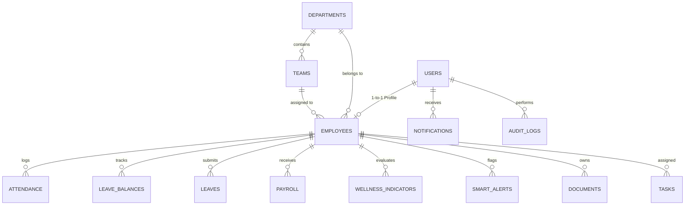

# DayFlow HRMS – Database Layer Documentation

> **Production-Ready SQLite Database Architecture for DayFlow Human Resource Management System**

---

## 1. Overview & Architecture

The **DayFlow HRMS Database Layer** is an enterprise-grade, high-performance relational storage solution built on **SQLite** using **`better-sqlite3`** (with universal compatibility fallback to Node.js native `node:sqlite`).

### Key Highlights
- **ACID Compliance & Foreign Key Enforcement**: `PRAGMA foreign_keys = ON;` is strictly enforced across every connection.
- **High Concurrency & Low Latency**: Write-Ahead Logging (`PRAGMA journal_mode = WAL;`) and `PRAGMA synchronous = NORMAL;` provide fast reads and non-blocking transactional writes.
- **Historical HR Data Protection**: `ON DELETE RESTRICT` ensures critical compliance, attendance, leave, and payroll records are never accidentally deleted.
- **Privacy & Security**: Zero medical/mental-health data storage (wellness uses strictly attendance/leave trend analytics). Passwords are never stored in plain text (bcrypt hashes).
- **Atomic Multi-Step Workflows**: Built-in transactional helpers for complex business flows like leave approval (balance deduction + attendance update + notification + audit log).

---

## 2. Directory Structure

```
DayFlow/
└── backend/
    └── database/
        ├── database.js          # SQLite connection manager, query wrappers & atomic transactions
        ├── schema.sql           # Complete DDL tables, constraints, foreign keys & indexes
        ├── seed.js              # Enterprise demo seed data generator
        ├── validate.js          # Automated integrity & constraint test suite (10/10 tests)
        ├── dayflow.db           # SQLite database file (auto-generated)
        ├── package.json         # Database module dependencies & scripts
        └── README.md            # Complete database architecture documentation
```

---

## 3. Database Schema & Tables



### Table Definitions

| Table | Purpose | Primary Key | Key Constraints |
| :--- | :--- | :--- | :--- |
| `users` | Authentication & credentials | `id` | `email UNIQUE`, `role IN ('Employee', 'HR')`, `is_active` |
| `departments` | Organizational divisions | `id` | `name UNIQUE` |
| `teams` | Departmental sub-teams | `id` | FK `department_id` (RESTRICT), FK `manager_id` (SET NULL) |
| `employees` | Profile, designations, manager | `id` | `employee_id UNIQUE`, `user_id UNIQUE`, `employment_status` |
| `attendance` | Daily clock-in/out logs & hours | `id` | `UNIQUE(employee_id, date)`, `status IN ('Present','Absent','Late','Half-day','Leave')` |
| `leave_balances` | Accrued & consumed time off | `id` | `UNIQUE(employee_id, leave_type, year)`, `leave_type` |
| `leaves` | Leave applications & approvals | `id` | `status IN ('Pending','Approved','Rejected','Cancelled')` |
| `payroll` | Monthly compensation breakdown | `id` | `UNIQUE(employee_id, pay_month, pay_year)`, `status IN ('Draft','Processed','Paid')` |
| `notifications`| User alert dispatch | `id` | `type IN ('Leave','Payroll','Attendance','Alert','System')`, `is_read` |
| `wellness_indicators` | Work-related wellness scores | `id` | `indicator_level IN ('Stable','Monitor','Needs Attention')` |
| `smart_alerts` | HR anomaly pattern alerts | `id` | `severity IN ('Low','Medium','High')`, `is_resolved` |
| `audit_logs` | Security & compliance logs | `id` | Immutable trail: action, entity_type, entity_id, user_id |
| `documents` | Secure document metadata | `id` | FK `employee_id` (RESTRICT), FK `uploaded_by` (SET NULL) |
| `holidays` | Company calendar holidays | `id` | `date UNIQUE` |
| `tasks` | Action items & HR assignments | `id` | `priority IN ('Low','Medium','High')`, `status IN ('Pending','In Progress','Completed')` |

---

## 4. Foreign Key Rules & Referential Integrity

- **`ON DELETE RESTRICT`**: Applied to core HR history (`users`, `departments`, `teams`, `employees`, `attendance`, `payroll`, `leaves`, `leave_balances`, `documents`). Prevents accidental loss of compliance records.
- **`ON DELETE SET NULL`**: Applied to optional references and reviewers (`manager_id`, `reviewed_by`, `resolved_by`, `created_by`, `uploaded_by`).

---

## 5. Performance Indexes

The schema creates 18+ high-cardinality indexes:
- `idx_users_email`
- `idx_employees_employee_id`, `idx_employees_department_id`, `idx_employees_team_id`
- `idx_attendance_employee_id`, `idx_attendance_date`, `idx_attendance_status`
- `idx_leaves_employee_id`, `idx_leaves_status`, `idx_leaves_start_date`
- `idx_payroll_employee_id`, `idx_payroll_pay_year`, `idx_payroll_pay_month`
- `idx_notifications_user_id`, `idx_notifications_is_read`
- `idx_wellness_employee_id`, `idx_wellness_indicator_level`
- `idx_smart_alerts_employee_id`, `idx_smart_alerts_severity`, `idx_smart_alerts_is_resolved`
- `idx_audit_logs_user_id`, `idx_audit_logs_entity_type`

---

## 6. Seed Data & Default Credentials

The seed script creates realistic enterprise demo records across all tables.

### Default Login Accounts

| Role | Name | Email | Password |
| :--- | :--- | :--- | :--- |
| **HR Admin** | DayFlow HR Admin | `admin@dayflow.com` | `Admin@123` |
| **Employee (Lead)** | John Doe | `john.doe@dayflow.com` | `Employee@123` |
| **Employee (Frontend)** | Sarah Jenkins | `sarah.jenkins@dayflow.com` | `Employee@123` |
| **Employee (Backend)** | Michael Chen | `michael.chen@dayflow.com` | `Employee@123` |
| **Employee (HR Talent)**| Emily Davis | `emily.davis@dayflow.com` | `Employee@123` |
| **Employee (Finance)** | Robert Taylor | `robert.taylor@dayflow.com` | `Employee@123` |
| **Employee (Marketing)**| Jessica Martinez | `jessica.martinez@dayflow.com` | `Employee@123` |

### Running the Seed Script
```bash
# Seed if database is empty
node backend/database/seed.js

# Force re-seed (overwriting existing records)
node backend/database/seed.js --force
```

---

## 7. Running the Automated Validation Test Suite

To verify all 10 integrity constraints and transactional safety guarantees:

```bash
node backend/database/validate.js
```

### Tests Covered:
1. **Duplicate Email Prevention** (`UNIQUE` constraint on `users.email`)
2. **Duplicate Employee ID Prevention** (`UNIQUE` constraint on `employees.employee_id`)
3. **Duplicate Attendance Prevention** (`UNIQUE(employee_id, date)`)
4. **Duplicate Payroll Prevention** (`UNIQUE(employee_id, pay_month, pay_year)`)
5. **Foreign Key Pragma Enforcement** (`PRAGMA foreign_keys = ON`)
6. **Invalid Employee Reference Rejection** (FK violation check)
7. **Invalid Department Reference Rejection** (FK violation check)
8. **Leave Balance Constraints** (`UNIQUE(employee_id, leave_type, year)`)
9. **ACID Transaction Rollback Integrity** (Automatic state rollback upon error)
10. **Multi-Step Business Transaction Execution** (Leave approval atomic orchestration)

---

## 8. Express Backend Integration Guide

Import the database helpers into your Express controllers and services:

```javascript
const { 
    getDb, 
    query, 
    get, 
    run, 
    runTransaction,
    executeLeaveApprovalTransaction,
    processPayrollTransaction 
} = require('./database/database');

// 1. Fetching all active employees
function getEmployees(req, res) {
    const employees = query(`
        SELECT e.*, u.name, u.email, d.name as department_name, t.name as team_name
        FROM employees e
        JOIN users u ON e.user_id = u.id
        LEFT JOIN departments d ON e.department_id = d.id
        LEFT JOIN teams t ON e.team_id = t.id
        WHERE e.employment_status = 'Active'
    `);
    res.json({ success: true, data: employees });
}

// 2. Approving a leave atomically
function approveLeave(req, res) {
    try {
        const { leaveId } = req.params;
        const reviewerId = req.user.id; // From auth middleware

        const result = executeLeaveApprovalTransaction({
            leaveId: Number(leaveId),
            reviewerId,
            status: 'Approved'
        });

        res.json({ success: true, message: 'Leave approved and balances updated.', result });
    } catch (err) {
        res.status(400).json({ success: false, message: err.message });
    }
}
```

---

## 9. Database Backup & Recovery

### Online SQLite Backup (Hot Backup)
To safely backup the database while the application is active:

```bash
# Using SQLite CLI online backup
sqlite3 backend/database/dayflow.db ".backup 'backend/database/backups/dayflow_backup_$(date +%Y%m%d_%H%M%S).db'"
```

### Node.js Scripted Backup
```javascript
const fs = require('fs');
const path = require('path');
const { getDb } = require('./database');

function backupDatabase(targetPath) {
    const db = getDb();
    // better-sqlite3 native backup
    if (typeof db.rawDb?.backup === 'function') {
        return db.rawDb.backup(targetPath);
    }
    // Fallback file copy under lock
    fs.copyFileSync(
        path.join(__dirname, 'dayflow.db'), 
        targetPath
    );
}
```

### Security Precaution
> [!CAUTION]
> **Never serve `dayflow.db` through Express static middleware.** Ensure `express.static()` points only to `public/` or `dist/` directories, and never to `backend/database/`.

---

## 10. Database Reset Instructions

If you need to completely reset the database to a clean state:

```bash
# 1. Delete existing database and journal files
rm backend/database/dayflow.db backend/database/dayflow.db-wal backend/database/dayflow.db-shm

# 2. Re-initialize and seed
node backend/database/seed.js

# 3. Validate
node backend/database/validate.js
```
